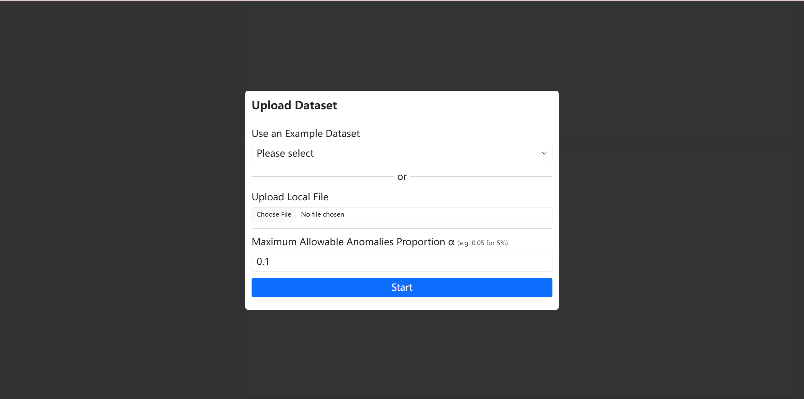
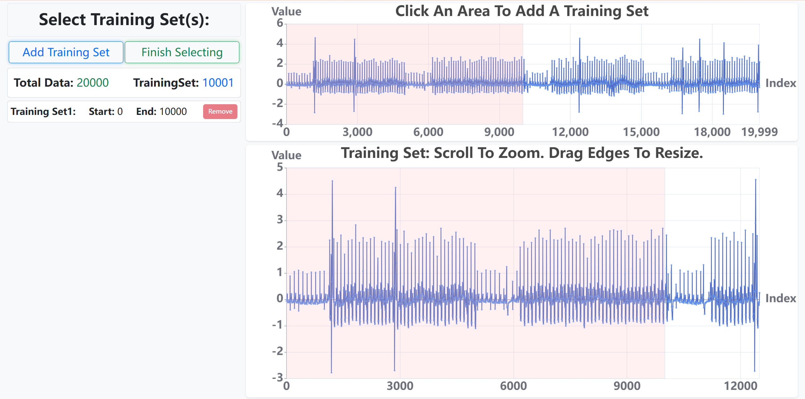
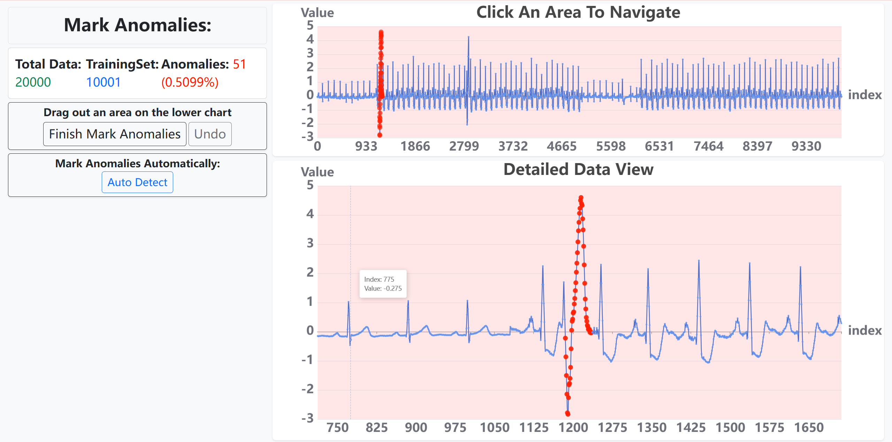
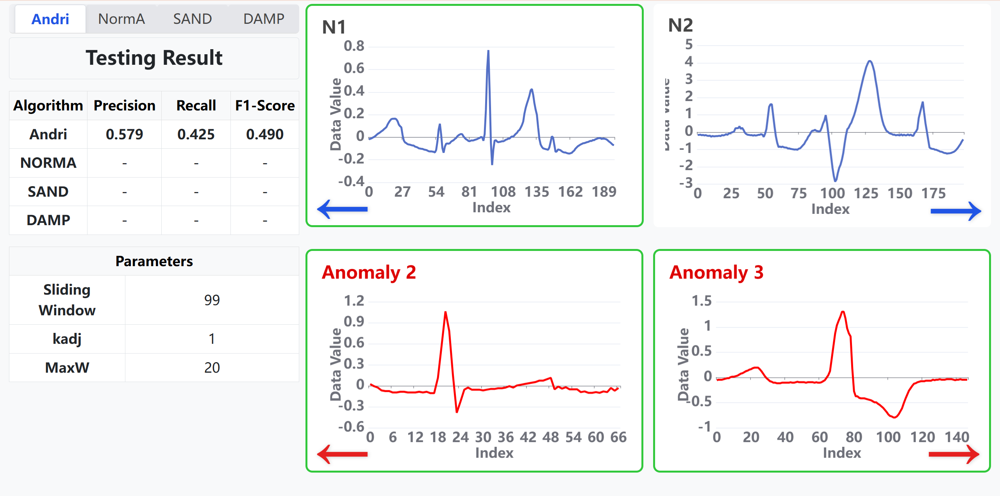

# Andri Demo

## 1 Overview

A system for Anomaly detection in the presence of Drift, and enables users to interactively co-explore the interaction
of anomalies and drift.

## 2. References of this repository
- https://github.com/TheDatumOrg/TSB-UAD
- https://github.com/mac-dsl/AnDri

## 3. Dataset
In the folder "static/datasets", there are three instance datasets.

## 3.1 Repeat ECG 

### 3.2 Weather data
- The Weather dataset is a hourly, geographically aggregated temperature and radiation information in Europe originated from the NASA MERRA-2.

### 3.3 Elec
- The Elec. dataset is a half-hourly aggregated electricity usage patterns in New South Wales, Australia.

## 4. Quick Start

### 4.1 Prerequisites
Python 3.9.0

- **If you want to use the NORMA algorithm, you must obtain `norma.py` and place it under `algorithms/norma/`.**
  - The `norma.py` file is proprietary and is not included in this repository.
  - You can use all other algorithms without `norma.py`.
  - To obtain `norma.py`, please contact the authors.

### 4.2 Clone the repository and enter the project directory

```bash
git clone https://github.com/ZeeChee-Guo/AndriDemo.git
cd AndriDemo
```
### 4.3 Clone the repository and enter the project directory:
On Windows:
 ```
 python -m venv venv
 venv\Scripts\activate
 ```

On macOS/Linux:
```
python3 -m venv venv
source venv/bin/activate
```

### 4.4 Install dependencies
```
pip install -r requirements.txt
```

### 4.5 Run the Flask server

```bash
python app.py
```

Once the server is running, open your browser and navigate to http://localhost:5000/ to start using AnDriDemo.


## 5. Usage
The system is designed as a web application with a Python Flask backend and a JavaScript-based frontend for interactive visualization and user labeling.


### 5.1 Upload Data

Go to http://localhost:5000/. Choose one of our example datasets or upload your own dataset. Then set α, which means that the proportion of outliers cannot exceed this value. 


### 5.2 Select Training Set(s)

Click on the "chart" on the upper right to add the training set, and adjust the size of the training set in the lower "chart".


### 5.3 Mark Anomalies

Click on a certain area on the upper right chart to navigate, and drag on the lower right chart to mark the abnormal points.

### 5.4 Evaluate Points

Based on the Normal Pattern other information, determine whether some points are anomalies or normal points.


### 5.5 Repeat With Other Algorithms
Click on the other algorithms in the tab bar, repeat the process of active learning, and find the thresholds for the other algorithms.


### 5.6 View Results

Examine the accuracy rates of each algorithm, and also understand why Andri achieved better results


## 6. Source Code
The source code is available at  [AndriDemo](https://github.com/mac-dsl/AnDriDemo)